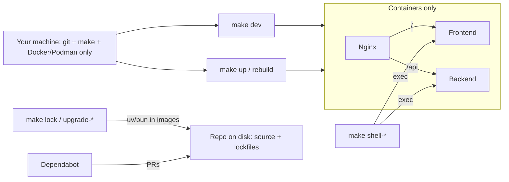

# Docker-first development and dependencies

## Goal

**Security protocol (applies to both `make dev` and `make up` / production):** do not install the project toolchain on your machine. The “host” is your DGX Spark / laptop. Allowed: **Docker or Podman** (compose), **git**, and **make**. Not allowed / not required: host `uv`, `bun`, Python 3.12, Node, `pip`, or any host-managed `node_modules` / `.venv`.

There is **no host-process path** for the app. Development and production differ only in *how* containers are configured (reload + source mounts vs baked images), not in *whether* code and dependencies run on the machine.

| | `make dev` | `make up` / `rebuild` (prod) |
|--|------------|------------------------------|
| Runs where | Containers only | Containers only |
| Deps live | Named volumes inside compose | Image layers from Dockerfiles (`uv sync --locked`, `bun install --frozen-lockfile`) |
| Source | Bind-mounted from repo (hot reload) | Copied into image at build |
| Entry URL | nginx :80 | nginx :80 |
| Host toolchain | None | None |
| Shells / lock updates | `make shell-*`, `make lock` / `upgrade-*` (containerized) | Same lock targets; `shell-*` against running prod stack |

**Lockfiles:** [`backend/uv.lock`](backend/uv.lock) and [`frontend/bun.lock`](frontend/bun.lock) are regenerated by containerized `uv` / `bun`, committed to git, and kept current for Dependabot — file I/O into the repo, not installing software onto the host.

## Approach

One security posture, two compose profiles:

- **Production** — [`docker-compose.yaml`](docker-compose.yaml): baked images, no host language installs.
- **Development** — plus [`docker-compose.dev.yaml`](docker-compose.dev.yaml): same engine/prereqs; bind-mount **source** only; install trees in **named volumes**.

Engine-agnostic Makefile (`COMPOSE`); align with existing Podman `release`/`push`.



### What touches the host disk vs what does not

| On your machine (OK) | Never on your machine (dev or prod) |
|----------------------|-------------------------------------|
| Git clone of source | `uv`, `bun`, Python, Node toolchains |
| Committed lockfiles / manifests | Host `uv sync` / `bun install` |
| Spark data dirs bind-mounted into containers | Host-managed `.venv` / `node_modules` |
| Docker/Podman engine | Host uvicorn / Next / Make spawning non-container app processes |

## Runtime changes

### 1. Dev Compose overlay — `docker-compose.dev.yaml`

- **Backend:** bind-mount `./backend` → `/app` for source + lockfile visibility; **named volume** for `.venv` (or uv cache) so packages are not a host install; run `uv run uvicorn ... --reload`; mount Spark **data** dirs via env (not container `$HOME`):
  - `DGX_LAB_MODELS_DIR`, `DGX_LAB_*_DIR`, `DATA_DESIGNER_HOME`, Cursor/Claude paths as needed
  - Host paths like `~/.cache/huggingface/hub`, `~/.dgx-lab`, etc. (application data, not language toolchains)
- **GPU:** NVIDIA device reservation so Monitor/`nvidia-smi` work in-container. Document Podman GPU/CDI equivalents.
- **Frontend:** bun-based dev image (not the production runner). Bind-mount `./frontend` for source; **named volume(s)** for `node_modules` (and workspace package stores as needed). Command `bun install && bun run dev` runs only inside the container.
- **Nginx:** single browser entry on **port 80** for prod and dev.
- **API rewrite:** [`frontend/apps/web/next.config.mjs`](frontend/apps/web/next.config.mjs) uses `API_PROXY_TARGET` (Compose sets `http://backend:8000`). No localhost assumption for the container stack.
- **Interactive access:** `compose exec` into named services; dev services stay root/usable for shells (production `nextjs` user does not apply to the bun dev service).

### 2. Makefile — container engine, shells, and lockfile maintenance

```makefile
COMPOSE ?= $(shell command -v docker >/dev/null && echo "docker compose" || echo "podman compose")
```

All targets use `$(COMPOSE)` or one-shot `docker`/`podman run` images. **No Makefile recipe may invoke host `uv` or `bun`, or start the app as a host process.**

#### How lockfiles update without a host sync

`uv` and `bun` are **never installed on your machine**. Makefile targets start a one-shot container that already contains the tool. Only the repo directory is bind-mounted so the container can rewrite lockfiles/manifests in git. Package installs are either skipped by CLI flags or redirected into an **anonymous volume** so they cannot appear as a host-managed `.venv` / `node_modules`.

```bash
# Backend — resolve/write uv.lock only (no project .venv sync)
podman run --rm -v "$(PWD)/backend:/app" -w /app \
  -v /app/.venv \
  ghcr.io/astral-sh/uv:python3.12-bookworm-slim \
  uv lock --upgrade-package "$(PKG)"
# or: uv add --no-sync "$(PKG)"

# Frontend — rewrite bun.lock without installing into node_modules
podman run --rm -v "$(PWD)/frontend:/app" -w /app \
  -v /app/node_modules \
  oven/bun:1.3 \
  bun install --lockfile-only
# upgrades: bun update … then bun install --lockfile-only if needed;
# anonymous -v /app/node_modules discards any install tree
```

(Use `docker run` the same way; Makefile picks the engine.)

| Layer | What happens |
|-------|----------------|
| Your machine | No `uv`/`bun` binary. Only git-visible files change under `backend/` / `frontend/`. |
| Container | Official image provides `uv` or `bun`; resolution hits the registry from inside the container. |
| Bind mount | `./backend` or `./frontend` ↔ `/app` so updated `uv.lock` / `bun.lock` / manifests land in the repo. |
| Anonymous volume `-v /app/.venv` / `-v /app/node_modules` | Masks those paths so any accidental install stays in a throwaway volume, not on your disk. |
| Dev/prod runtime later | `make dev` installs into **named** compose volumes; `make rebuild` installs into **image layers**. Neither is a host sync. |

Concrete Make recipes:

| Target | Container command (intent) |
|--------|----------------------------|
| `make lock` | `uv lock` + `bun install --lockfile-only` |
| `make upgrade-backend` | `uv lock --upgrade` or `uv lock --upgrade-package $(PKG)` |
| `make upgrade-frontend` | `bun update $(PKG)` (with node_modules anonymously masked) + ensure lockfile written |
| `make audit-backend` | Container `uv audit` — **report only** ([Astral `uv audit`](https://astral.sh/blog/uv-audit)); does not rewrite `uv.lock` |
| `make audit-frontend` | Container `bun audit` — **report only**; does not rewrite `bun.lock` |
| `make audit` | Runs both `audit-backend` and `audit-frontend` |
| `make add-backend PKG=...` | `uv add --no-sync $(PKG)` (updates `pyproject.toml` + `uv.lock`, skips venv sync) |
| `make add-frontend PKG=...` | `bun add $(PKG)` with `node_modules` masked, or add then `--lockfile-only` |

| Other targets | Behavior |
|--------|----------|
| `make dev` | Dev compose up `--build` (foreground) — containers only |
| `make up` / `build` / `rebuild` / `down` / `logs` | Production compose via `$(COMPOSE)` — containers only |
| `make shell-*` | `exec -it` into **running** containers (dev or prod stack) |

#### Parallel audit → upgrade → re-audit workflows (Bun and uv)

Both [`bun audit`](https://bun.com/docs/pm/cli/audit) and [`uv audit`](https://astral.sh/blog/uv-audit) are **scan-only** (preview for uv; no `uv audit --fix` / `bun audit fix` yet). They do not rewrite lockfiles. Remediation is always a separate lock upgrade in a one-shot container, then re-audit.

**Frontend (Bun)**

1. `make audit-frontend` → `bun audit` in `oven/bun:1.3`  
2. `make upgrade-frontend PKG=<name>` or broader `bun update` / `bun update --latest` (mask `node_modules`)  
3. Re-run `make audit-frontend`; commit `bun.lock`  
4. `make rebuild` or restart `make dev`  

**Backend (uv)** — same shape, per [Vulnerability and malware checks in uv](https://astral.sh/blog/uv-audit):

1. `make audit-backend` → containerized `uv audit` against `./backend` (needs a uv image new enough for audit preview, ≥ ~0.10.12; pin/document that tag). Example:

```bash
podman run --rm -v "$(PWD)/backend:/app" -w /app -v /app/.venv \
  ghcr.io/astral-sh/uv:python3.12-bookworm-slim \
  uv audit
```

2. For each flagged package: `make upgrade-backend PKG=<name>` → `uv lock --upgrade-package <name>` (works for direct **and** transitive deps without adding them to `pyproject.toml`). If constraints block a safe version, widen the range in `pyproject.toml` via `uv add --no-sync` / edit, then re-lock.  
3. Re-run `make audit-backend`; commit `uv.lock` (+ manifest if changed).  
4. `make rebuild` or restart `make dev` so **containers** sync — never host `uv sync`.

**Optional malware gate on sync (uv preview):** Astral’s opt-in `UV_MALWARE_CHECK=1` runs an OSV malware lookup on sync/add and aborts before install if the lock matches known malware. Plan: set `UV_MALWARE_CHECK=1` on backend **dev and prod** compose services (and document it) so container syncs get the check without installing uv on the host. Keep it clearly marked preview/unstable per Astral.

**`make audit`:** run both audits for a full Dependabot/security pass before upgrading.

After lockfile changes: commit them, then `make rebuild` or restart `make dev` so **containers** pick up new pins. Never run host `uv sync` / `bun install`.

### 3. Dependabot + resolving security alerts

There is **no** [`.github/dependabot.yml`](.github/dependabot.yml) today. Add one so GitHub opens PRs that touch the committed lockfiles:

- **Backend:** `package-ecosystem: uv` (or `pip` if `uv` ecosystem is unavailable on the account), `directory: /backend`, weekly schedule — updates `pyproject.toml` / `uv.lock` as Dependabot supports.
- **Frontend:** `package-ecosystem: npm` with `directory: /frontend` (Bun workspaces; Dependabot uses the npm ecosystem against `package.json` + lockfile — verify `bun.lock` is recognized; if not, document that security bumps are applied via `make upgrade-frontend PKG=…` and committed manually until Bun ecosystem support is solid).
- **Docker base images** (optional but useful): `package-ecosystem: docker` for `backend/` and `frontend/` Dockerfiles.
- **GitHub Actions** (optional): ecosystem `github-actions` at `/`.

**Maintainer workflow for an alert / Dependabot PR:**

1. `make audit` (or `audit-backend` / `audit-frontend`) to list current CVEs from committed lockfiles.  
2. If Dependabot opened a clean PR that updates `uv.lock` / `bun.lock` — review, re-audit, `make rebuild` to verify, merge.  
3. If incomplete/conflict/alert-only: `make upgrade-backend PKG=<name>` and/or `make upgrade-frontend PKG=<name>` (or full `upgrade-*`), re-audit, commit lockfile + any manifest bumps.  
4. Never edit lockfiles by hand; always regenerate via container targets so hashes match `uv sync --locked` / `bun install --frozen-lockfile` in image builds.

### 4. Production compose — same posture, baked images

Production is not a looser path. It uses the **same** rule: no host toolchain; app only via containers.

- Keep Dockerfiles and bake-at-build (`uv sync --locked`, `bun install --frozen-lockfile`) so runtime deps exist **only inside image layers**.
- Same Spark data mounts + GPU reservation as dev so `make up` is a real Spark deployment, not a UI shell.
- Same `API_PROXY_TARGET=http://backend:8000` on frontend.
- `make shell-*` works against the production stack when it is up (debugging prod containers without installing tools on the machine).
- Docs must **not** describe Docker as “production only” and host install as “development.”

## Docs and skills (one protocol for dev and prod)

- [`README.md`](README.md): one security protocol for **both** `make dev` and `make up`. Prerequisites = Docker **or** Podman only (no Python/Bun for either path). Document add/lock/upgrade/shell, `COMPOSE=...`, Dependabot.
- [`docs/setup.md`](docs/setup.md) and [`docs-site/docs/setup.md`](docs-site/docs/setup.md): remove host-install “Development” sections; frame as Dev compose vs Prod compose under the same posture.
- [`.cursor/skills/fork-setup/SKILL.md`](.cursor/skills/fork-setup/SKILL.md): drop “Docker = production only”; containers required for all run modes.
- Agents (technical-writer, developer-advocate, etc.): no host `uv sync` / `bun install` as a run path for either mode.

## Explicit non-goals

- Not offering or documenting a host-process `make dev` / host uvicorn+Next alternative.
- Not installing or recommending a host language toolchain for runtime or dependency management (dev or prod).
- Not deleting production Dockerfiles or GHCR `release`/`push` targets.
- Not forcing Cursor/IDE language servers into containers (indexing the repo on disk ≠ package install).
- Not requiring rootless Podman tweaks beyond documenting GPU/compose pitfalls if they block the Spark path.
- Not auto-merging Dependabot PRs or adding a full security-scanning CI pipeline in this pass.
- `make docs` / docs-site: follow-up to containerize, or call out as remaining host-Bun until then — must not reintroduce host Bun as the app workflow.
