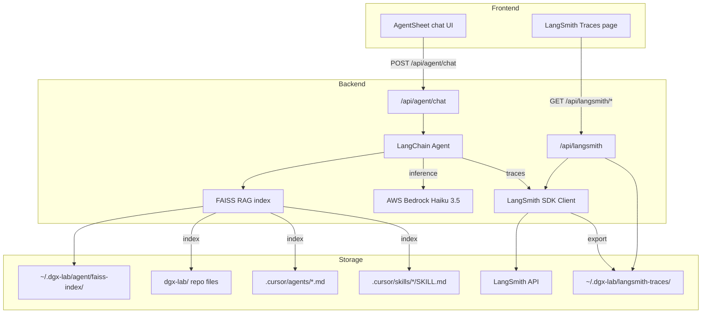

# LangSmith Traces Page + DGX Lab Agent

## Part 1: LangSmith Traces tool page (toggleable)

### Backend

**New router:** `backend/app/routers/langsmith_traces.py`

Dual-source approach -- live API + local export fallback:

- `GET /` -- list runs from LangSmith API (`GET /runs/query` on the LangSmith REST API), fall back to local JSONL at `~/.dgx-lab/langsmith-traces/` if `LANGSMITH_API_KEY` is unset or the API is unreachable.
- `GET /{run_id}` -- run detail with child spans.
- `GET /sessions` -- list LangSmith projects/sessions.
- `GET /feedback` -- feedback/eval scores for runs.
- `GET /status` -- connection status (API reachable, project name, fallback mode).

Use the `langsmith` Python SDK (`Client`) for API calls. The SDK is already referenced in the skills and handles auth via `LANGSMITH_API_KEY` env var.

**Config:** Add `LANGSMITH_TRACES_DIR` to [backend/app/config.py](backend/app/config.py) for local export path, defaulting to `~/.dgx-lab/langsmith-traces/`.

**Registration:** Add to [backend/app/main.py](backend/app/main.py):
```python
app.include_router(langsmith_traces.router, prefix="/api/langsmith", tags=["langsmith"])
```

**Dependencies:** Add `langsmith` to [backend/pyproject.toml](backend/pyproject.toml).

**Logging:** Add `/api/langsmith/sessions`, `/api/langsmith/status` to `POLL_PATHS` in [backend/app/logging_config.py](backend/app/logging_config.py).

### Frontend

**New page:** `frontend/apps/web/app/(tools)/langsmith/page.tsx`

Follow the same three-panel layout as the existing [Traces page](frontend/apps/web/app/(tools)/traces/page.tsx):
- Left: run list (name, latency, tokens, cost, status dot)
- Center: span waterfall (child runs as nested spans)
- Right: run detail (inputs, outputs, feedback scores, metadata)

Header tabs: **Runs / Sessions / Feedback**

Header note: `LangSmith API · ~/.dgx-lab/langsmith-traces/`

Reuse existing trace components where shapes match (`TraceList`, `Waterfall`, `SpanDetail`), or create parallel `langsmith/` components if the data shape diverges enough.

**Sidebar:** Add to the "Traces" section in [app-sidebar.tsx](frontend/apps/web/components/app-sidebar.tsx):
```typescript
{ href: "/langsmith", label: "LangSmith", icon: "◎", optional: true, settingsKey: "langsmith-traces" }
```

**Settings:** Add `"langsmith-traces": false` to the `DEFAULTS.enabledTools` map in [settings-context.tsx](frontend/apps/web/lib/settings-context.tsx).

**Layout:** Add `"/langsmith": "LangSmith Traces"` to the `toolNames` map in [layout.tsx](frontend/apps/web/app/(tools)/layout.tsx).

---

## Part 2: DGX Lab Agent (Bedrock RAG in Agent Sheet)

### Backend

**New router:** `backend/app/routers/agent_chat.py`

Endpoints:
- `POST /chat` -- accepts `{ message: string, conversation_id?: string }`, returns streamed or complete response. Runs the LangChain agent with RAG context.
- `GET /conversations` -- list past conversations.
- `GET /conversations/{id}` -- conversation history.
- `DELETE /conversations/{id}` -- clear a conversation.

**Agent implementation** (in `backend/app/agent/` directory):
- `chain.py` -- LangChain `create_agent()` with Bedrock client using Claude Haiku 3.5 (cheapest Anthropic model on Bedrock: `anthropic.claude-3-5-haiku-20241022-v1:0`).
- `rag.py` -- RAG pipeline:
  - **Document loading:** Walk the repo tree, respect `.cursorignore` patterns, skip `node_modules/`, `.venv/`, binary files.
  - **Splitting:** `RecursiveCharacterTextSplitter` with language-aware splitting for `.py`, `.tsx`, `.ts`, `.md`.
  - **Embeddings:** Use a local embedding model via HuggingFace (`sentence-transformers/all-MiniLM-L6-v2` -- small, runs on CPU, no GPU memory impact).
  - **Vector store:** FAISS (already referenced in agents-engineer scope; in-memory, local-first, no external service).
  - **Index lifecycle:** Build on first query, persist to `~/.dgx-lab/agent/faiss-index/`. Rebuild on `POST /agent/reindex`.
- `personas.py` -- Load `.cursor/agents/*.md` files at startup, parse frontmatter and body. The agent's system prompt includes a "team directory" section listing each persona's name and scope, so it can adopt the right voice when answering domain-specific questions.
- `skills.py` -- Load `.cursor/skills/*/SKILL.md` files. Index them as RAG documents with high relevance weight. The agent can reference skill instructions when answering how-to questions about LangChain, LangSmith, etc.
- `tracing.py` -- Configure LangSmith tracing on the agent chain:
  - Set `LANGCHAIN_TRACING_V2=true`, `LANGCHAIN_PROJECT=dgx-lab-agent`.
  - All agent invocations automatically traced to LangSmith (visible in the new LangSmith Traces page).
  - Export traces locally to `~/.dgx-lab/langsmith-traces/` as JSONL for offline viewing.

**Config additions** in [config.py](backend/app/config.py):
```python
AGENT_INDEX_DIR = Path(os.getenv("DGX_LAB_AGENT_INDEX_DIR", str(Path.home() / ".dgx-lab" / "agent")))
LANGSMITH_TRACES_DIR = Path(os.getenv("DGX_LAB_LANGSMITH_TRACES_DIR", str(Path.home() / ".dgx-lab" / "langsmith-traces")))
CODEBASE_ROOT = Path(os.getenv("DGX_LAB_CODEBASE_ROOT", str(Path.cwd())))
```

**Dependencies** to add to [pyproject.toml](backend/pyproject.toml):
- `langchain` (core)
- `langchain-aws` (Bedrock integration)
- `langchain-community` (FAISS, document loaders)
- `langsmith` (tracing + API client)
- `faiss-cpu` (vector store, CPU-only -- no GPU memory impact)
- `sentence-transformers` (local embeddings)

**Registration:** Add to [main.py](backend/app/main.py):
```python
app.include_router(agent_chat.router, prefix="/api/agent", tags=["agent"])
```

### Frontend

**Update:** [agent-sheet.tsx](frontend/apps/web/components/agent-sheet.tsx)

Replace the "coming soon" placeholder with a working chat interface:
- Message list with user/assistant bubbles (user: right-aligned, elevated bg; assistant: left-aligned, surface bg).
- Streaming response display (if using SSE) or loading state.
- Input field (enabled, monospace, 11px) with Send button.
- Conversation state managed via `useState` with API calls to `/api/agent/chat`.
- Persona indicator: show which agent persona context was used (small pill above the response).
- Source citations: when RAG retrieves documents, show file paths as clickable references below the response.

Design tokens per the design system:
- Assistant responses in `--surface` bg, user messages in `--elevated` bg.
- Citations in `font-mono text-[10px]` with `--text-tertiary` color.
- Persona pills in `--color-purple-dim` bg with `--color-purple` text (matches the AGENT button style).

### Evals

**Backend:** `backend/app/agent/evals.py`

- Define a LangSmith evaluation dataset for the DGX Lab agent using the `langsmith-dataset` skill patterns.
- Seed questions: "How does the Monitor tool work?", "What is the memory budget?", "How do I add a new tool?", "What does the ML Engineer own?", "How is the frontend structured?"
- Evaluator: LLM-as-Judge (correctness against codebase ground truth) using the `langsmith-evaluator` skill patterns.
- Results visible in the LangSmith Traces page under the Feedback tab.

---

## Data flow



## Files changed (summary)

**New files:**
- `backend/app/routers/langsmith_traces.py`
- `backend/app/routers/agent_chat.py`
- `backend/app/agent/__init__.py`
- `backend/app/agent/chain.py`
- `backend/app/agent/rag.py`
- `backend/app/agent/personas.py`
- `backend/app/agent/skills.py`
- `backend/app/agent/tracing.py`
- `backend/app/agent/evals.py`
- `frontend/apps/web/app/(tools)/langsmith/page.tsx`

**Modified files:**
- `backend/app/config.py` -- new path constants
- `backend/app/main.py` -- register two new routers
- `backend/app/logging_config.py` -- add langsmith poll paths
- `backend/pyproject.toml` -- add langchain/langsmith/faiss deps
- `frontend/apps/web/components/agent-sheet.tsx` -- replace placeholder with chat UI
- `frontend/apps/web/components/app-sidebar.tsx` -- add LangSmith entry
- `frontend/apps/web/lib/settings-context.tsx` -- add langsmith-traces default
- `frontend/apps/web/app/(tools)/layout.tsx` -- add langsmith to toolNames
- `.env.example` -- already has `LANGSMITH_API_KEY` and Bedrock keys
