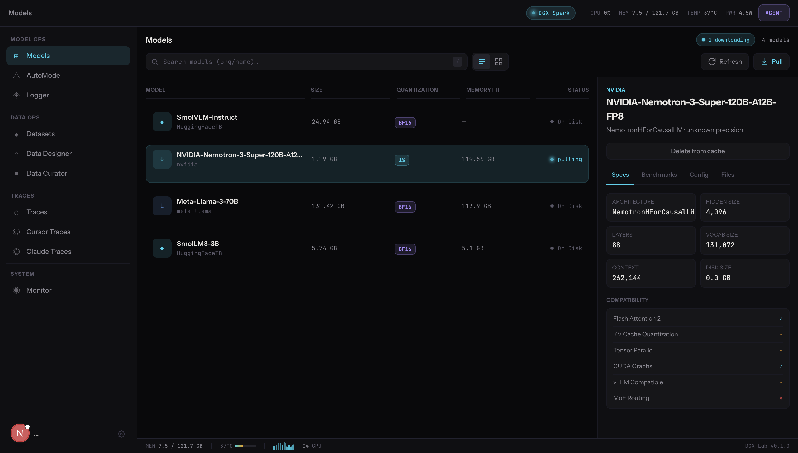
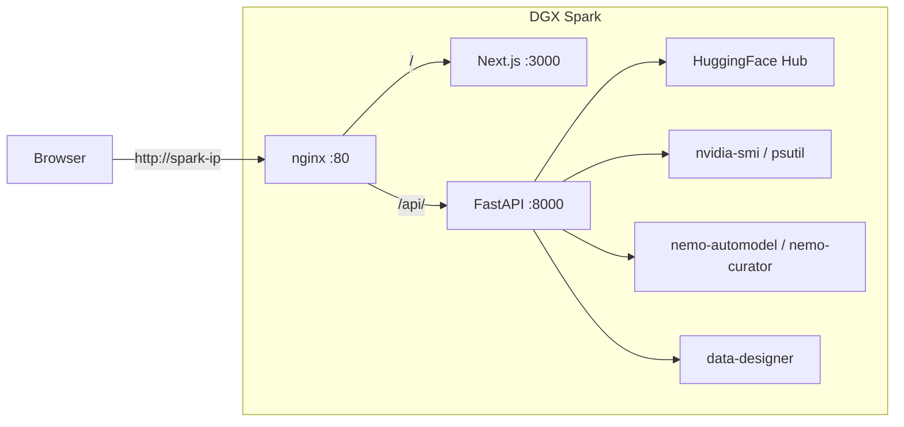
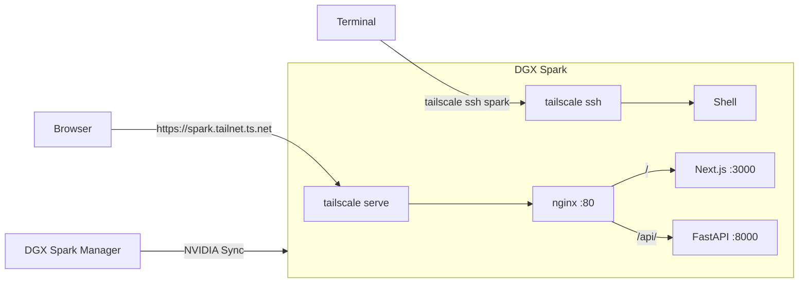

# DGX Lab

Local-first developer dashboard for the NVIDIA DGX Spark.

> **This project is built for DGX Spark hardware.** If you don't own a DGX Spark (GB10 Grace Blackwell, 128 GB unified memory), this repo is not useful to you. The tools assume Spark-local model storage, `nvidia-smi` access, and memory budgets specific to the GB10. There is no hosted version.

<p align="center">
  
</p>

## What it is

Eight tools that run on your Spark and give you a single UI for the things you'd otherwise do across a dozen terminal windows:

| Tool | What it does |
|------|-------------|
| **Control** | Model library -- scan your HuggingFace cache, search the Hub, pull models, see memory fit vs 128 GB |
| **Logger** | Experiment tracker -- loss curves, run comparison, reads SQLite/Parquet/JSONL metrics from `~/.dgx-lab/experiments/` |
| **Traces** | Agent trace viewer -- waterfall timeline, span detail, cost/token aggregation from JSONL traces |
| **Monitor** | GPU dashboard -- gauges, system timeline, process table, CUDA kernel timeline via `nvidia-smi` and `psutil` |
| **AutoModel** | NeMo training recipes -- SFT, LoRA, pretraining, distillation, QAT with job tracking |
| **Designer** | Synthetic data generation -- configure providers/models, generate datasets, preview output |
| **Curator** | Data curation pipelines -- NeMo Curator stages (cleaning, filtering, dedup, safety), job runner |
| **Datasets** | Dataset browser -- local and HuggingFace datasets, file listing, row preview, Hub search and pull |

## Architecture

On the same LAN, hit `http://<spark-ip>` directly:



Off-network, connect via NVIDIA Sync (macOS app) or Tailscale:



## Security note

DGX Lab is self-hosted and local-only -- a Mac browser talking to a DGX Spark on the same LAN or over a Tailscale tunnel. There is no public deployment. CORS is set to `allow_origins=["*"]` because the only clients are your own devices on a private network.

## Stack

| Layer | Choice |
|-------|--------|
| Frontend | Next.js 16 (App Router, Turbopack), TypeScript 5.9, Tailwind CSS 4, shadcn v4, Recharts |
| Monorepo | Turborepo, Bun workspaces (`apps/web`, `packages/ui`) |
| Backend | Python 3.12, FastAPI, uvicorn |
| Deps | uv (`pyproject.toml`) -- huggingface-hub, psutil, pyarrow |
| Infra | Docker Compose (frontend + backend + nginx) |
| Remote access | Tailscale (`tailscale serve`, `tailscale ssh`) |

## Accounts

| Account | Required | What for |
|---------|----------|----------|
| [Cursor](https://cursor.com/) | Yes | Primary IDE. The agent team in `.cursor/agents/` drives development and enforces project conventions. |
| [Anthropic](https://anthropic.com/) | Recommended | Claude Desktop, Claude Code, and the Claude Code CLI collaborate with Cursor as part of the development workflow. |
| [Hugging Face](https://huggingface.co/) | Yes | Model and dataset downloads, Hub search, pushing artifacts. Set `HF_TOKEN` for gated models. |
| [Tailscale](https://tailscale.com/) | Recommended | Remote access to DGX Lab from off-network. Free for personal use. |
| [AWS](https://aws.amazon.com/) | Optional | Cloud burst only -- S3 for large checkpoints/datasets, EC2 p-series or SageMaker for multi-GPU training that exceeds the Spark. Not needed if you stay local. |

## Quickstart

### Prerequisites

- NVIDIA DGX Spark
- Python 3.12+ with [uv](https://docs.astral.sh/uv/)
- [Bun](https://bun.sh/) 1.3+

### Clone to your Spark

SSH into your DGX Spark (or open a terminal on it directly) and clone:

```bash
git clone https://github.com/jxtngx/dgx-lab.git ~/dgx-lab
cd ~/dgx-lab
```

### Install and run

```bash
cd backend && uv sync && cd ..
cd frontend && bun install && cd ..
make dev
```

Open `http://localhost:3000` on the Spark, or `http://<spark-ip>:3000` from your Mac on the same LAN.

### Docker (production)

```bash
make build
make up
```

nginx serves on port 80. Stop with `make down`, rebuild with `make rebuild`, logs with `make logs`.

### Make targets

| Command | What it does |
|---------|-------------|
| `make dev` | Start backend (uvicorn, port 8000, hot reload) and frontend (bun, port 3000) in parallel. Ctrl+C stops both. |
| `make up` | Start Docker Compose containers in background |
| `make down` | Stop Docker Compose containers |
| `make build` | Build Docker images |
| `make rebuild` | Build and start containers in one command |
| `make logs` | Tail Docker Compose logs |

## Data directories

DGX Lab reads and writes to these paths on the Spark (all overridable via env vars):

| Path | Env var | Used by |
|------|---------|---------|
| `~/.cache/huggingface/hub` | `DGX_LAB_MODELS_DIR` | Control |
| `~/.dgx-lab/experiments` | `DGX_LAB_EXPERIMENTS_DIR` | Logger |
| `~/.dgx-lab/traces` | `DGX_LAB_TRACES_DIR` | Traces |
| `~/.dgx-lab/designer` | `DGX_LAB_DESIGNER_DIR` | Designer (generated output) |
| `~/.data-designer` | `DATA_DESIGNER_HOME` | Designer (library config — `model_providers.yaml`, `model_configs.yaml`; owned by `data-designer`, read by DGX Lab) |
| `~/.dgx-lab/curator` | `DGX_LAB_CURATOR_DIR` | Curator |
| `~/.dgx-lab/datasets` | `DGX_LAB_DATASETS_DIR` | Datasets |

Hardware constants default to Spark specs and can be overridden:

| Env var | Default |
|---------|---------|
| `DGX_LAB_MEMORY_TOTAL_GB` | `128` |
| `DGX_LAB_MEMORY_BW_MAX_GBS` | `273` |

## Remote access

On the same LAN, open `http://<spark-ip>` in any browser.

Off-network, two options:

| Method | How |
|--------|-----|
| **NVIDIA Sync** | Connect to your Spark from the macOS [DGX Spark Manager](https://apps.apple.com/app/nvidia-dgx-spark-manager/id6740461958) app. Built-in, no extra accounts. |
| **Tailscale** | Install on Spark and laptop. Run `tailscale serve http://localhost:80` on the Spark, then open `https://spark.your-tailnet.ts.net` from anywhere. Also gives `tailscale ssh` for terminal access. |

## Project structure

```
dgx-lab/
├── frontend/
│   ├── apps/web/          # Next.js app (routes, components, hooks)
│   ├── packages/ui/       # Shared UI components (shadcn, Tailwind)
│   └── package.json       # Turborepo workspaces
├── backend/
│   ├── app/main.py        # FastAPI app, CORS, router registration
│   ├── app/config.py      # DGX_LAB_* env vars, memory constants
│   ├── app/routers/       # One router per tool (8 total)
│   ├── app/mock_data/     # Mock data for development
│   └── pyproject.toml     # uv-managed dependencies
├── docker-compose.yaml    # frontend + backend + nginx
├── nginx.conf             # Reverse proxy config
├── Makefile               # dev, up, down, build, logs, rebuild
└── docs/                  # Setup and usage guides
```

## Maintainer tooling

DGX Lab is built and maintained with [Cursor](https://cursor.com/) and [Anthropic](https://anthropic.com/) Claude as core development agents. The `.cursor/agents/` directory contains 9 specialized agent definitions (Chief Architect, Designer, Backend Engineer, AI Engineer, ML Engineer, AWS Engineer, Tailscale Engineer, Technical Writer, Developer Advocate) that encode project conventions, subsystem boundaries, and the DGX Lab design system. They are the persistent context that keeps contributions aligned without a style guide someone has to remember to read. The Developer Advocate agent is there to help anyone who clones or forks the repo get oriented, troubleshoot setup, and understand the architecture well enough to work independently.

## Resources

- [NVIDIA DGX Spark — build.nvidia.com](https://build.nvidia.com/spark)
- [DGX Spark User Guide](https://docs.nvidia.com/dgx/dgx-spark/)
- [NVIDIA NeMo Framework](https://docs.nvidia.com/nemo-framework/user-guide/latest/overview.html)

## License

[Apache 2.0](LICENSE)
