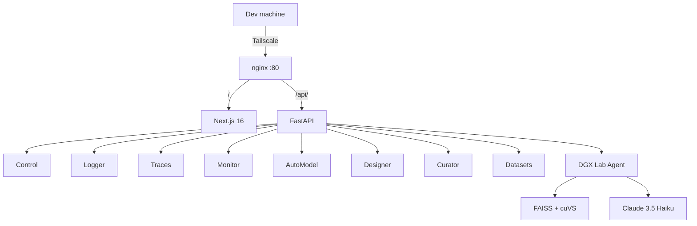

import MemoryBudgetChart from '@site/src/components/blog/MemoryBudgetChart';
import SparkArchitecture from '@site/src/components/blog/SparkArchitecture';

DGX Lab is a local-first developer dashboard for the NVIDIA DGX Spark. Eight tools for model management, experiment tracking, agent observability, GPU profiling, training recipes, synthetic data, data curation, and dataset browsing -- all memory-aware against 128 GB of unified LPDDR5X.

This post walks through what it is, what it runs on, and how it fits together.

{/* truncate */}

## The hardware

The DGX Spark is a desktop with a GB10 Grace Blackwell SoC: an Arm-based Grace CPU and a Blackwell GPU sharing 128 GB of unified memory at roughly 273 GB/s. FP4, FP8, and FP16 precision. No discrete VRAM -- the memory pool is shared between CPU and GPU, which changes how you think about model loading and inference budgets.

<SparkArchitecture />

## Memory budget

128 GB sounds like a lot until you load a 70B model. Quantization helps -- a 70B at Q4 fits in around 38 GB, leaving room for KV cache, activations, and the system overhead. DGX Lab's Control tool shows this breakdown for every model in your HuggingFace cache.

<MemoryBudgetChart />

The chart above shows a typical allocation when serving a 70B Q4 model. The "Available" segment is what's left for additional workloads, experiments, or a second model.

## The tools

DGX Lab ships eight tools, each backed by a FastAPI router and rendered by a Next.js page:

| Tool | Route | What it does |
|------|-------|-------------|
| **Control** | `/control` | Model library -- scan HF cache, search Hub, pull models, memory fit estimates |
| **Logger** | `/logger` | Experiment tracker -- run metrics from SQLite, Parquet, JSONL |
| **Traces** | `/traces` | Agent trace viewer -- span waterfall, cost/token aggregation |
| **Monitor** | `/monitor` | GPU dashboard -- gauges, system timeline, process table |
| **AutoModel** | `/automodel` | NeMo training recipes -- SFT, LoRA, pretraining, distillation, QAT |
| **Designer** | `/designer` | Synthetic data generation with provider/model config |
| **Curator** | `/curator` | NeMo Curator data curation pipelines and stage browser |
| **Datasets** | `/datasets` | Local and HuggingFace dataset browser with row preview |

Every tool that touches model loading or training reasons about the 128 GB budget. Control shows memory fit bars. Monitor tracks GPU utilization in real time. AutoModel validates that a training recipe will fit before launching.

## The stack

```
Frontend:   Next.js 16  ·  React 19  ·  Tailwind CSS 4  ·  shadcn v4
Backend:    FastAPI  ·  Python 3.12  ·  uv
Deploy:     Docker Compose  ·  nginx  ·  Tailscale
Hardware:   DGX Spark  ·  GB10 Grace Blackwell  ·  128 GB LPDDR5X
Agent:      LangChain  ·  Claude 3.5 Haiku (Bedrock)  ·  FAISS + cuVS  ·  LangSmith
```

The frontend is a Turborepo monorepo with Bun workspaces. `apps/web` is the Next.js app; `packages/ui` holds shared shadcn components. The backend runs on the Spark itself -- FastAPI with async routers, one per tool. Docker Compose bundles frontend, backend, and an nginx reverse proxy. Tailscale provides remote access from a Mac or any device on the tailnet.

## Architecture



The DGX Lab Agent is a RAG-backed assistant that treats the entire codebase as its knowledge base. It uses `nvidia/llama-embed-nemotron-8b` for embeddings, FAISS with cuVS GPU acceleration for vector search, and `nvidia/llama-nemotron-rerank-1b-v2` for reranking. The LLM is Claude 3.5 Haiku via AWS Bedrock. All interactions are traced with LangSmith.

## Design language

Dark base. Cyan is earned -- active states, live-status dots, critical metrics only. Monospace for machine data, sans for navigation and prose. Density over decoration. The dashboard should feel like it was built by someone who runs large models at 2am, not a marketing team.

| Token | Value | Use |
|-------|-------|-----|
| `--background` | `#09090b` | Page base |
| `--surface` | `#0f0f12` | Sidebar, panels |
| `--elevated` | `#161619` | Cards, inputs |
| `--color-cyan` | `#22d3ee` | Primary accent -- scarce |

## What's next

DGX Lab is open source under Apache 2.0. Clone it, fork it, adapt it for your hardware. The architecture is modular: adding a tool means one FastAPI router, one Next.js page, one sidebar entry.

```bash
git clone https://github.com/jxtngx/dgx-lab.git
cd dgx-lab
make dev
```

The [docs](/docs/intro) cover setup, tool guides, and API reference. The codebase is the documentation.
